# LLM Alpha Mining

**English** | [简体中文](README.zh-CN.md)

[](https://github.com/ZebinZ/llm-alpha-mining/actions/workflows/tests.yml)

**An LLM-assisted factor research framework: from structured candidates to reproducible computation, evaluation, and research deliverables.**

Language models propose and review research hypotheses. Deterministic code validates formulas, aligns data, computes factors, evaluates results, and records their provenance. Models cannot execute arbitrary Python, and external out-of-sample results must stay outside the search feedback loop.

This is a compact public edition of a research project, containing actual framework code and a synthetic-data demonstration. Market data, the original candidate pool, platform results, and research submissions remain in the private archive. The project does not train or fine-tune a foundation model.

## Quick start

Use Python 3.12 or 3.13. Installation downloads Python dependencies; the demo then runs entirely offline, without an API key.

```bash
git clone https://github.com/ZebinZ/llm-alpha-mining.git
cd llm-alpha-mining
python -m venv .venv
source .venv/bin/activate
python -m pip install -e '.[test]'
alpha-demo --output outputs/demo
alpha-demo --output outputs/demo --verify
python -m pytest -q
```

On Windows PowerShell, activate the environment with `.venv\Scripts\Activate.ps1`. The demo requires a new output directory; use a different path, such as `outputs/demo-2`, for another run.

The demo uses scripted role responses and seeded synthetic data for 100 business days and 40 fictional stocks. Three candidates enter review, one receives a risk veto, and two are computed by the actual `FactorEngine`. An additional fictional index checks that non-stock instruments stay outside the stock cross-section. Missing values and rolling-window warm-up periods remain missing.

The output directory contains:

| File | Contents |
| --- | --- |
| `report.json` | Run summary, reproducibility signature, and demo scope |
| `candidate_specs.json` | Candidate definitions bound to data, operators, and formula identities |
| Two factor Parquet files | Float64 signal values |
| `descriptive_metrics.parquet` | Daily descriptive correlations, coverage, and group diagnostics |
| `factor_correlations.parquet` | Daily correlations between the two demo signals |
| `llm_calls.jsonl` | Offline role-call and budget ledger |
| `manifest.json` | SHA-256 hashes for artifact verification |

These outputs verify software behavior. They do not establish that a real factor works, and they are not a formal backtest or an out-of-sample evaluation.

## Research workflow

```mermaid
flowchart LR
    A[Mechanism hypotheses and allowed fields] --> B[Proposer candidates]
    B --> C[DSL validation]
    C --> D[Critic and Risk review]
    D --> E[Arbiter and deterministic decision]
    E --> F[Point-in-time data and factor computation]
    F --> G[Time-based validation and cost evaluation]
    G --> H[Deduplication, ranking, and artifact manifest]
    H --> I[Independent platform evaluation]
    I --> J[Freeze deliverables after user selection]
```



The demo covers role review, formula computation, descriptive diagnostics, and artifact verification. Formal evaluation, portfolio construction, and multigeneration orchestration modules have separate synthetic tests. The demo does not contact an external platform or start a new research campaign.

## Code map

| Module | Responsibility |
| --- | --- |
| `factor_production/v5/llm` | Structured protocols, role review, budgets, idempotent calls, and exact replay |
| `factor_production/v5/dsl` | Abstract syntax tree allowlists, window and depth limits, future-field restrictions, and point-in-time operators |
| `factor_production/v5/orchestration` | Candidate lineage, state transitions, SQLite persistence, checkpoint recovery, and stopping conditions |
| `alpha_research/core`, `data` | Data contracts, snapshots, temporal semantics, quality checks, and hashes |
| `alpha_research/factors` | Binding formulas to data versions and computing point-in-time factors |
| `alpha_research/labels`, `validation`, `evaluation` | Label alignment, temporal splits, and factor evaluation |
| `alpha_research/portfolio`, `costs`, `backtest` | Portfolio constraints, turnover and costs, and execution-aware backtests |
| `alpha_research/agents` | Restricted HTTP adapters and bridges between protocol versions |
| `alpha_demo` | Default demo entry point with synthetic data and scripted offline responses |
| `tests` | Portable tests extracted from the research project and end-to-end demo checks |

The directory names follow the original implementation. Package exports were reduced for the public edition; the retained scientific computation algorithms were preserved. Vendor-specific runners and historical approval-driven execution entry points are outside this release.

## Problems addressed

- Constraining free-form LLM output to verifiable research candidates, with deterministic enforcement of risk vetoes.
- Separating instrument identity, the tradable universe at signal time, and historical observations to avoid cross-sectional contamination and unnecessary loss of history.
- Connecting research results to data versions, formula identities, code, and artifact hashes for review and recovery.
- Evaluating candidates with temporal validation and costs while keeping external out-of-sample results separate from search.
- Supporting bulk recomputation after data corrections, correlation-based selection, and traceable submission packaging in the full private workflow. Its research data and performance figures are not published here.

See [Architecture and design](docs/architecture.md), [Reproducibility and integration](docs/reproducibility.md), and [Project scope and status](docs/project_scope.md). Each document has a complete Chinese counterpart.

## From the demo to your own research

Run the offline example first, then follow the [integration guide](docs/reproducibility.md) to build a runner for your own data source and model provider. The repository preserves components for automated factor research, while the public demo uses scripted model responses. It does not start live trading or provide automatic access to the original project's private data.
