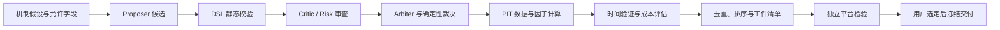

# LLM Alpha Mining

[English](README.md) | **简体中文**

[](https://github.com/ZebinZ/llm-alpha-mining/actions/workflows/tests.yml)

**LLM 辅助的因子研究框架：从结构化候选到可复现的计算、评估和交付。**

该项目把语言模型用于提出和审查研究假设，由确定性的代码负责公式校验、数据对齐、因子计算、评估和审计。模型不能直接执行任意 Python，也不能把外部样本外成绩反馈进搜索流程。

这是研究项目的精简展示版本，包含实际框架源码和合成数据演示。原项目的市场数据、具体候选池、平台结果及交付文件单独保存在本地。没有训练或微调基础大模型。

## 五分钟运行

需要 Python 3.12 或 3.13。首次安装需要下载 Python 依赖，之后示例完全离线，不需要 API Key。

```bash
git clone https://github.com/ZebinZ/llm-alpha-mining.git
cd llm-alpha-mining
python -m venv .venv
source .venv/bin/activate
python -m pip install -e '.[test]'
alpha-demo --output outputs/demo
alpha-demo --output outputs/demo --verify
python -m pytest -q
```

Windows PowerShell 用 `.venv\Scripts\Activate.ps1` 激活环境。输出目录须为新目录，重复演示可改为 `outputs/demo-2`。

示例使用固定的角色回复和随机种子生成的 100 日、40 只虚拟股票数据：3 个候选进入审查，风险否决 1 个，剩余 2 个通过真实 `FactorEngine` 计算。另放入一个虚拟指数，验证它不会进入股票横截面；缺失值及滚动预热期保留为缺失。

结果保存在输出目录：

| 文件 | 内容 |
| --- | --- |
| `report.json` | 运行摘要、可复现签名和演示范围 |
| `candidate_specs.json` | 绑定数据、算子和公式身份的定义 |
| 两份因子 Parquet | float64 信号值 |
| `descriptive_metrics.parquet` | 逐日描述性相关、覆盖和分组诊断 |
| `factor_correlations.parquet` | 两个演示信号的逐日相关性 |
| `llm_calls.jsonl` | 离线角色调用及预算账本 |
| `manifest.json` | 文件 SHA-256，供完整性校验 |

这些数字用于验证软件流程，不能说明真实因子有效，也不构成正式回测或样本外检验。

## 研究流程



演示覆盖角色审查、公式计算、描述性诊断和工件验证。正式评估、组合及多代调度模块由独立合成测试验证；演示不会自动调用外部平台或运行新的研究队列。

## 代码导航

| 模块 | 负责什么 |
| --- | --- |
| `factor_production/v5/llm` | 结构化协议、角色审查、预算、幂等调用、精确回放 |
| `factor_production/v5/dsl` | AST 白名单、窗口和深度限制、禁止未来字段、PIT 算子 |
| `factor_production/v5/orchestration` | 候选谱系、状态迁移、SQLite、断点恢复和停止条件 |
| `alpha_research/core`、`data` | 数据契约、快照、时间语义、质量检查和哈希 |
| `alpha_research/factors` | 公式与数据版本绑定、PIT 因子引擎 |
| `alpha_research/labels`、`validation`、`evaluation` | 标签对齐、时间切分、因子评估 |
| `alpha_research/portfolio`、`costs`、`backtest` | 组合约束、换手与成本、执行时点回测 |
| `alpha_research/agents` | 通用受限 HTTP 适配器和新旧协议桥接 |
| `alpha_demo` | 唯一默认演示入口，使用合成数据和离线回复 |
| `tests` | 从实际项目抽取的可移植测试及端到端演示验收 |

框架目录保留原有命名，以便对照原始实现。展示版精简了包的导出入口，未修改被保留的科学计算算法。数据供应商专用运行器和历史审批执行入口不属于这个发布版本。

## 项目中解决的问题

- 把 LLM 的自由文本约束为可验证的研究候选，风险否决具有确定性约束。
- 把股票身份、当日可交易范围与历史观察范围分开，防止横截面污染和不必要的历史损失。
- 用数据版本、公式身份、代码和工件哈希连接研究结果，支持复核与恢复。
- 用时间验证和成本评估筛选候选，保持外部样本外结果与搜索隔离。
- 在完整私有流程中完成数据修正后的批量重算、相关性筛选和上传工件打包；具体研究数据和成果指标不随展示代码发布。

详见 [架构与设计](docs/architecture.zh-CN.md)、[复现与接入](docs/reproducibility.zh-CN.md)、[项目范围与后续](docs/project_scope.zh-CN.md)。

## 从演示到自己的研究

先运行离线示例，再阅读[复现与接入](docs/reproducibility.zh-CN.md)，为自己的数据来源和模型服务编写运行器。框架保留了自动化研究的组件，但公开演示使用固定模型回复；它不会直接启动实盘交易，也不会自动访问原项目的私有研究数据。
